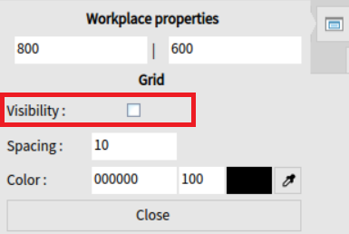
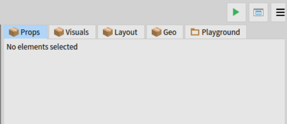

# Table des matières

[1 Ouvrir l’outil Pyramid
[3](#ouvrir-loutil-pyramid)](#ouvrir-loutil-pyramid)

[2 Prise en main de Pyramid
[4](#prise-en-main-de-pyramid)](#prise-en-main-de-pyramid)

[2.1 Raccourcis claviers
[4](#raccourcis-claviers)](#raccourcis-claviers)

[2.1.1 Interne à Pyramid [4](#interne-à-pyramid)](#interne-à-pyramid)

[2.1.2 Externe à Pyramid [5](#externe-à-pyramid)](#externe-à-pyramid)

[2.2 Description des interfaces
[5](#description-des-interfaces)](#description-des-interfaces)

[2.2.1 Barre d’outils de paramétrage
[6](#barre-doutils-de-paramétrage)](#barre-doutils-de-paramétrage)

[2.2.1.1 Bouton cacher la fenêtre de navigation
[6](#bouton-cacher-la-fenêtre-de-navigation)](#bouton-cacher-la-fenêtre-de-navigation)

[2.2.1.2 Bouton sauvegarder
[6](#bouton-sauvegarder)](#bouton-sauvegarder)

[2.2.1.3 Bouton configuration de projet
[7](#bouton-configuration-de-projet)](#bouton-configuration-de-projet)

[2.2.1.4 Bouton de paramètre utilisateur
[9](#bouton-de-paramètre-utilisateur)](#bouton-de-paramètre-utilisateur)

[2.2.1.5 Bouton rafraîchissement
[10](#bouton-rafraîchissement)](#bouton-rafraîchissement)

[2.2.2 Boutons annuler / refaire (Undo/Redo)
[10](#boutons-annuler-refaire-undoredo)](#boutons-annuler-refaire-undoredo)

[2.2.3 Barre d’outils de l’espace de travail
[11](#barre-doutils-de-lespace-de-travail)](#barre-doutils-de-lespace-de-travail)

[2.2.3.1 Bouton test [11](#bouton-test)](#bouton-test)

[2.2.3.2 Bouton propriétés de l’espace de travail
[11](#bouton-propriétés-de-lespace-de-travail)](#bouton-propriétés-de-lespace-de-travail)

[2.2.3.3 Bouton cacher la fenêtre de propriétés
[13](#bouton-cacher-la-fenêtre-de-propriétés)](#bouton-cacher-la-fenêtre-de-propriétés)

[2.2.4 Fenêtre de navigation
[14](#fenêtre-de-navigation)](#fenêtre-de-navigation)

[2.2.4.1 Bouton ajouter une nouvelle racine
[14](#bouton-ajouter-une-nouvelle-racine)](#bouton-ajouter-une-nouvelle-racine)

[2.2.4.1.1 Colonne des catégories
[15](#colonne-des-catégories)](#colonne-des-catégories)

[2.2.4.1.2 Colonne de visualisation du contenu de la catégorie
[16](#colonne-de-visualisation-du-contenu-de-la-catégorie)](#colonne-de-visualisation-du-contenu-de-la-catégorie)

[2.2.4.1.3 Colonne de prévisualisation
[16](#colonne-de-prévisualisation)](#colonne-de-prévisualisation)

[2.2.4.2 Bouton cochable cacher/montrer les fils
[17](#bouton-cochable-cachermontrer-les-fils)](#bouton-cochable-cachermontrer-les-fils)

[2.2.4.3 Liste des fils dans l’espace de travail
[19](#liste-des-fils-dans-lespace-de-travail)](#liste-des-fils-dans-lespace-de-travail)

[2.2.5 Menu contextuel clic droit
[19](#menu-contextuel-clic-droit)](#menu-contextuel-clic-droit)

[2.2.5.1 Rechercher l’élément sélectionné
[20](#rechercher-lélément-sélectionné)](#rechercher-lélément-sélectionné)

[2.2.5.2 Inspection de l’élément sélectionné
[21](#inspection-de-lélément-sélectionné)](#inspection-de-lélément-sélectionné)

[2.2.5.3 Ajout d’enfant et suppression d’élément
[22](#ajout-denfant-et-suppression-délément)](#ajout-denfant-et-suppression-délément)

[2.2.5.4 Modifier l’index d’un enfant dans son parent
[23](#modifier-lindex-dun-enfant-dans-son-parent)](#modifier-lindex-dun-enfant-dans-son-parent)

[2.2.5.5 Grouper la sélection d’éléments
[24](#grouper-la-sélection-déléments)](#grouper-la-sélection-déléments)

[2.2.5.6 Niveau sur le calque
[24](#niveau-sur-le-calque)](#niveau-sur-le-calque)

[2.2.5.7 Copier/Coller [25](#copiercoller)](#copiercoller)

[2.2.6 Fenêtre des propriétés
[25](#fenêtre-des-propriétés)](#fenêtre-des-propriétés)

[2.2.6.1 Onglet propriétés (Props)
[25](#onglet-propriétés-props)](#onglet-propriétés-props)

[2.2.6.2 Onglet visuels (Visuals)
[27](#onglet-visuels-visuals)](#onglet-visuels-visuals)

[2.2.6.3 Onglet de disposition (layout)
[28](#onglet-de-disposition-layout)](#onglet-de-disposition-layout)

[2.2.6.3.1 Disposition basique
[28](#disposition-basique)](#disposition-basique)

[2.2.6.3.2 Disposition linéaire
[29](#disposition-linéaire)](#disposition-linéaire)

[2.2.6.3.3 Disposition écoulement (Flow)
[30](#disposition-écoulement-flow)](#disposition-écoulement-flow)

[2.2.6.3.4 Disposition en cadre (Frame)
[31](#disposition-en-cadre-frame)](#disposition-en-cadre-frame)

[2.2.6.4 Onglet géométrie (Geo)
[31](#onglet-géométrie-geo)](#onglet-géométrie-geo)

[2.2.6.5 Onglet gestion de thème (Toplo-Theme)
[32](#onglet-gestion-de-thème-toplo-theme)](#onglet-gestion-de-thème-toplo-theme)

[2.2.6.5.1 Ajout de thème pour toplo theme manager
[34](#ajout-de-thème-pour-toplo-theme-manager)](#ajout-de-thème-pour-toplo-theme-manager)

[2.2.6.6 Onglet Playground [35](#onglet-playground)](#onglet-playground)

[2.2.7 Espace de travail [38](#espace-de-travail)](#espace-de-travail)

[2.3 Fonctionnalités [39](#fonctionnalités)](#fonctionnalités)

[2.3.1 Modification d’arborescence cliqué glissé / déposé
[39](#modification-darborescence-cliqué-glissé-déposé)](#modification-darborescence-cliqué-glissé-déposé)

[2.3.2 Redimensionnement dynamique d’élément sélectionné
[41](#redimensionnement-dynamique-délément-sélectionné)](#redimensionnement-dynamique-délément-sélectionné)

# Ouvrir l’outil Pyramid

Pour ouvrir Pyramid, dans un éditeur Pharo, aller dans Library -\>
Pyramid -\> New project, comme sur la capture d’écran :

Cela va directement ouvrir l’outil Pyramid dans une fenêtre de Pharo.

# Prise en main de Pyramid

## Raccourcis claviers

### Interne à Pyramid

| **Raccourcis** | **Combinaison de touche** | **Description** |
|:--:|:--:|----|
| Undo | CTRL + Z | Reviens en arrière sur l’action précédente s’il y en a. |
| Redo | CTRL + Y | Reviens en avant sur l’action où on est revenu précédemment. |
| Copier | 1 élément sélectionné + CTRL + C | Permet de copier l’élément qui est actuellement sélectionné. |
| Coller | CTRL + V | Permet de coller un élément qui a été précédemment copié sur l’espace de travail. |
| Coller dans un élément | 1 élément sélectionné + CTRL + V | Permet de coller dans un élément sélectionné et l’ajouter en tant que fils. |
| Couper | 1 élément sélectionné + CTRL + X | Permet de couper l’élément sélectionné. |
| Sauvegarder | CTRL + S | Permet de sauvegarder un projet ouvert et configuré. |
| Tout sélectionner | CTRL + A | Permet de sélectionner tous les éléments de l’espace de travail. |
| Sélectionner tous les fils | 1 élément sélectionné + CTRL + A | Permet de pouvoir sélectionner tous les fils de l’élément sélectionné. |
| Grille | CTRL + G | Permet d’activer / désactiver la grille sur l’espace de travail |
| Supprimer la sélection | 1 élément ou plus sélectionné + CTRL + D | Permet de supprimer le ou les éléments sélectionnés. |
| Inspecter l’élément | 1 élément sélectionné + CTRL + I | Permet d’inspecter l’élément sélectionné. |
| Déplacer un fils vers le haut | 1 élément sélectionné + CTRL + Flèche haut | Permet de déplacer vers le haut un fils dans l’arborescence de son parent. |
| Déplacer un fils vers le bas | 1 élément sélectionné + CTRL + Flèche bas | Permet de déplacer vers le bas un fils dans l’arborescence de son parent. |
| Déplacer la vue | CTLR + Cliqué déplacé | Permet le déplacement de la vue sur l’espace de travail. |
| Position par défaut de la vue | CTRL + N | Permet de remettre la position de la vue sur l’espace de travail par défaut (emplacement) |
| Zoomer sur l’espace de travail | CTRL + Mollette Haut | Permet de zoomer sur l’espace de travail. |
| Dé zoomer sur l’espace de travail | CTRL + Mollette Bas | Permet de dé zoomer sur l’espace de travail. |

Tous les raccourcis ci-dessous ne fonctionnent qu’avec le focus sur
l’espace (espace de travail) dans Pyramid.

| **Raccourcis** | **Combinaison de touche** | **Description** |
|:--:|:--:|----|
| Déplacer un élément vers le bas | 1 élément sélectionné + Flèche Bas | Permet de déplacer un élément sélectionné vers le bas. |
| Déplacer un élément vers la droite | 1 élément sélectionné + Flèche Droite | Permet de déplacer un élément sélectionné vers la droite. |
| Déplacer un élément vers la gauche | 1 élément sélectionné + Flèche Gauche | Permet de déplacer un élément sélectionné vers la gauche. |
| Déplacer un élément à la position de la souris | 1 élément sélectionné + CTRL + Barre Espace | Permet de déplacer un élément sélectionné à la position de la souris. |

### Externe à Pyramid

| **Raccourcis** | **Combinaison de touche** | **Description** |
|:--:|:--:|----|
| Ouvrir un space dans Pyramid | F12 + focus sur un space d’une fenêtre Bloc/Toplo | Permet d’ouvrir directement dans Pyramid une application qui tourne dans une autre fenêtre en cours d’exécution en Pharo Bloc/Toplo. |

## Description des interfaces

Tout d’abord, vous pouvez voir ci-dessous l’aperçu global de l’interface
lorsque vous ouvrez l’outil Pyramid.

### Barre d’outils de paramétrage

#### Bouton cacher la fenêtre de navigation 

Permet de cacher la fenêtre de navigation :

C’est un bouton bascule (toggle) vous pouvez donc cacher la fenêtre en
cliquant dessus, mais aussi la rendre visible lorsque vous cliquez une
deuxième fois dessus.

#### Bouton sauvegarder

Ce bouton sert à sauvegarder les modifications effectuées et génère le
code source correspondant.

Si la configuration du projet n’a pas été faite, une erreur est
affichée :

Pour y remédier, il faut au préalable définir la configuration du projet
(cf. bouton suivant).

#### Bouton configuration de projet

Pour configurer la sauvegarde du projet :

Le bouton ouvre une fenêtre qui permet de configurer l’emplacement de
sauvegarde du projet :

Pour configurer la sauvegarde du projet dans l’onglet du bouton
« project configuration » il faut remplir les trois champs suivants :

- Le nom du package

- Le nom de la classe

- Le nom de la méthode

Choisir s’il faut enregistrer en côté classe ou côté instance.

#### Bouton de paramètre utilisateur

Permet d’ouvrir l’interface de paramètres utilisateur de Pyramid avec
les deux paramètres suivants :

- Activer/Désactiver le raccourci F12 qui permet d’ouvrir dans Pyramid
  une fenêtre Bloc/Toplo

- Choisir le format de sérialisation soit en code source, soit en STON

Fenêtre de paramètre ci-dessous :

#### Bouton rafraîchissement

Permet de rafraîchir l’espace de travail (zone centrale) :

Ce bouton permet de résoudre les problèmes tels que la prévisualisation
du projet dans la zone centrale qui ne s’affiche plus, cela permet donc
de rafraîchir et de résoudre ce souci.

Exemple :

### Boutons annuler / refaire (Undo/Redo)

### 

Ces boutons sont situés au centre de la barre d’outils, au-dessus de la
zone de travail.

Le bouton avec une flèche vers la gauche (Undo) sert à revenir en
arrière sur une action passée et la flèche allant vers la droite (Redo)
permet de rejouer l’action précédemment annulée.

### Barre d’outils de l’espace de travail

#### Bouton test

Il permet de mettre en exécution l’espace de travail et donc, d’utiliser
les boutons comme par exemple afficher un message dans Pharo avec une
notification lorsqu’on clique dessus.

Lorsqu’on est en mode de test, l’icône du bouton est modifiée et on peut
sortir du mode test en recliquant dessus :

#### Bouton propriétés de l’espace de travail

Il permet de modifier la taille de l’espace de travail affiché dans la
partie de prévisualisation de l’IHM en ouvrant la fenêtre suivante :

Mais aussi de pouvoir afficher ou cacher une grille grâce à son
paramètre de visibilité :

On peut également modifier l’espacement entre deux lignes grâce à la
valeur du champ « Spacing » qui est modifiable.

La couleur est aussi paramétrable soit par valeur hexadécimal et son
alpha (transparence).

Ou grâce à une interface utilisateur disponible grâce au bouton
suivant :

L’interface du choix de couleur :

La première ligne correspond également au choix de couleur via une
valeur hexadécimale et d’un alpha (transparence).

Le choix des couleurs se fait via les interfaces.

Lorsque vous rentrez une valeur dans un champ textuel, veuillez bien
appuyer sur la touche « Entrée » pour valider les changements
(« Entrée » sur le clavier, pas le « Entrée » qui se situe sur le pavé
numérique).

#### Bouton cacher la fenêtre de propriétés

Ce bouton permet, comme pour le bouton cacher la fenêtre de navigation,
de pouvoir cacher la fenêtre de propriété à droite.

### Fenêtre de navigation

Cette fenêtre contient l’arborescence des éléments graphiques édités
dans le projet en cours, ainsi que des boutons / fonctionnalités
permettant de les manipuler.

#### Bouton ajouter une nouvelle racine

Ce bouton permet de rajouter un élément racine que l’on choisit via la
fenêtre qui s’ouvre. Voir ci-dessous.

##### Colonne des catégories

Cette colonne sert à afficher les différentes catégories disponibles et
de les afficher dans la colonne de visualisation du contenu de la
catégorie sélectionnée.

##### Colonne de visualisation du contenu de la catégorie

Cette colonne sert à visualiser les différents éléments disponibles dans
la catégorie sélectionnée dans la colonne des catégories.

##### Colonne de prévisualisation

Cette colonne sert à visualiser l’élément sélectionné dans la colonne de
droite et permet de l’ajouter dans l’espace de travail avec « add new
element ».

Exemple de l’ajout de l’élément :

#### Bouton cochable cacher/montrer les fils

Cette case à cocher permet de cacher (ou afficher) les fils d’éléments
avec lesquels on ne peut pas interagir dans Pyramid (élément non
sérialisé).

Exemple d’arborescence avec tous les enfants visibles :

Lorsque les enfants ne sont pas visibles :

#### Liste des fils dans l’espace de travail

Cette liste permet de voir tous les éléments courants utilisés dans
l’espace de travail, et permet d’observer l’arborescence courante du
projet.

On peut également interagir sur chaque élément avec un menu contextuel
grâce au clic droit.

### Menu contextuel clic droit

Ce menu contextuel fonctionne uniquement dans les zones suivantes :

- Fenêtre de navigation

- Espace de travail (zone centrale)

On peut apercevoir le menu contextuel qui affiche le nom, l’élément
(class) et son Hash sur la première ligne.

#### Rechercher l’élément sélectionné

Ouvre la fenêtre suivante pour afficher la classe de l’élément. Voir
ci-dessous.

#### Inspection de l’élément sélectionné

Permet de faire une inspection de l’élément comme si on le faisait
depuis un playground.

#### Ajout d’enfant et suppression d’élément

L’ajout d’enfant permet de pouvoir ajouter un élément en tant que fils à
l’élément sélectionné et donc de pouvoir l’ajouter à son arborescence.

La suppression de l’élément sélectionné permet de supprimer l’élément
ainsi que tous ses enfants.

Exemple de suppression de plusieurs éléments :

#### Modifier l’index d’un enfant dans son parent

Ces 2 options permettent de modifier très facilement l’index des enfants
sélectionnés dans leurs parents soit de l’augmenter soit de le réduire.

Exemple avant déplacement :

Exemple après déplacement :

Il y a également des raccourcis clavier pour le faire (Page Up et Page
Down).

#### Grouper la sélection d’éléments

Permet de grouper un ou plusieurs éléments sélectionnés dans un seul et
même groupe lors d’une multi-sélection.

#### Niveau sur le calque

Permet de modifier le niveau sur le calque de l’élément sélectionné :

- On foreground : place l’élément au premier plan

- On background : place l’élément en dernier

- Move forward : augmente d’un niveau de calque

- Move backward : réduit d’un niveau de calque

#### Copier/Coller

Permet de copier un élément sélectionné et de coller cet élément sur
l’espace de travail ou dans un autre élément qui est sélectionné.

### Fenêtre des propriétés

Voici la fenêtre des propriétés lorsqu’on ne sélectionne pas d’élément,
cette fenêtre est constituée de 6 onglets suivant :

- Props

- Visual

- Layout

- Geo

- Toplo-Theme

- Playground

#### Onglet propriétés (Props)

Les propriétés disponibles pour chaque élément sélectionné peuvent être
différentes selon la nature de l’élément.

Voici les options possibles dans Props lorsque l’on sélectionne un
élément :

Element ID :

C’est le nom en ID de l’élément sélectionné, pour le modifier il faut
écrire quelque chose à la place du texte déjà présent dans ce champ de
texte et **ne pas oublier de valider avec entrée** afin de rendre
effective la modification sinon la modification n’est pas sauvegardée.

Visibility :

Permet de rendre :

- Visible  : visible sur l’espace de
  travail

- caché   : caché sur l’espace de
  travail

- gone   : caché sur l’espace de
  travail et n’est pas calculé par la disposition

Elevation :

Valeur de l’élément sur le calque renseigné en valeur entière modifiable
ou visualisable.

Clip children :

Permet de rendre non visible les enfants d’un élément qui sortent de la
taille du parent (dépasse de la taille du parent) si la valeur est True,
l’inverse sinon.

#### Onglet visuels (Visuals)

C’est un onglet qui permet de définir les différentes propriétés
graphiques de l’élément sélectionné : l’opacité, la couleur, les
bordures, etc.

#### Onglet de disposition (layout)

Cet onglet permet de définir la position de l’élément dans son
environnement, mais également de définir une disposition dans cet
élément directement.

Position :

Emplacement en X et Y de l’élément sélectionné modifiable dans les deux
champs de saisie.

Remplissage :

Définis un remplissage dans l’élément sélectionné selon la valeur dans
le champ de saisie.

Marge :

Définis une marge dans l’élément sélectionné selon la valeur dans le
champ de saisie.

Type de disposition :

##### Disposition basique

La disposition basique permet de placer comme on veut sans contrainte
particulière d’élément dans l’élément sélectionné.

##### Disposition linéaire

Vertical :

L’élément vert est le premier élément et l’élément rouge est le
deuxième, selon le sens de la flèche ci-dessus sur l’exemple.

Horizontal :

L’élément vert est le premier élément et l’élément rouge est le
deuxième, selon le sens de la flèche ci-dessus sur l’exemple.

La disposition linéaire permet d’aligner des éléments même jusqu’à
dépasser la taille du parent.

##### Disposition écoulement (Flow)

Vertical :

Horizontal :

La flèche violette représente la première ligne de la disposition et la
flèche rouge la deuxième ligne. Lorsqu’une ligne est remplie, les
éléments sont ajoutés automatiquement à la ligne suivante. Ici,
l’élément en rose est ajouté automatiquement à la seconde ligne.

##### Disposition en cadre (Frame)

Les différents réglages de position ne se font pas dans le parent mais
dans les enfants de l’élément dans lequel il y a cette disposition.

Les contraintes – Frame – horizontal / vertical servent uniquement au
positionnement de cet élément-là dans son parent grâce à la disposition
définie dans le parent.

Cette option permet de ne pas aligner l’élément avec la disposition en
cadre.

#### Onglet géométrie (Geo)

Cet onglet permet de choisir la forme géométrique de l’élément
sélectionné, la géométrie sélectionnée sera celle visible sur le logo
sélectionné.

Certains éléments peuvent ne pas disposer de géométrie

#### Onglet gestion de thème (Toplo-Theme)

Cet onglet permet de définir et visualiser des thèmes en les appliquant
soit sur l’espace de travail (BlSpace) soit sur les différents éléments
dans l’espace de travail (thème local).

Lorsqu’on sélectionne un élément sur l’espace de travail plusieurs
actions sont possibles :

- Ne pas hériter du thème du parent et de choisir le thème à appliquer
  sur lui-même et ces enfants

- Ajouter une étiquette (stamp) sur l’élément sélectionné (grisé si
  aucun élément n’a été sélectionné).

- Supprimer une étiquette sélectionnée dans le tableau d’étiquette listé
  (grisé si aucune étiquette n’est sélectionnée).

Exemple (aucun thème appliqué) :

Exemple (après le thème appliqué) :

Les étiquettes à ajouter pour un élément sélectionné sont listées selon
le thème choisi pour cet élément.

Exemple :

Pour ajouter une étiquette il faut sélectionner l’étiquette que l’on
veut attribuer et cliquer sur « Ajouter une étiquette ».

Liste des étiquettes déjà utilisé sur l’élément sélectionné :

Supprimer une étiquette :

Une fois que l’on sélectionne une étiquette dans la liste, le bouton
« Remove stamp » (Supprimer l’étiquette) devient cliquable et permet de
supprimer l’étiquette sélectionné.

##### Ajout de thème pour toplo theme manager

Pour ajouter un thème à la liste des thèmes disponible dans le sélecteur
pour le toplo theme manager, il faut ajouter une méthode de classe dans
la classe du thème qui hérite ToTheme.

Exemple :

canBeDefault ^ true

Si l’on veut retirer un thème spécifique du sélecteur, il faut modifier
« true » par « false » :

canBeDefault ^ false

#### Onglet Playground

Le Playground est un onglet qui permet d’effectuer des actions sur un ou
des éléments sélectionnés grâce à du code Smalltalk (Pharo).

Seuls les raccourcis claviers natifs à Pharo permettent de pouvoir
exécuter des commandes dans le playground.

Voici l’onglet lorsqu’on ne sélectionne aucun élément, voir ci-dessus.

Les actions du Playground et s’exécutent sur le ou les éléments
sélectionnés.

Exemple avec un BlElement :

Avant modification :

Après modification :

Grâce au message suivant la couleur du background est devenue noire :

self background : Color black.

Ceci n’est qu’un exemple mais la totalité des messages dans le
Playground est possible comme nativement dans Pharo.

La petite particularité, c’est que plusieurs éléments sélectionnés sont
considérés comme un tableau d’objet, donc cette fois-ci la commande
précédente ne fonctionnera pas car il faut exécuter la commande sur tous
les éléments présents dans le tableau.

Avant :

La commande permet d’itérer sur chaque élément et d’appliquer la couleur
rouge sur l’arrière-plan de chaque élément :

self do: \[ :c \| c background: Color red \].

Après :

### Espace de travail

L’espace de travail est la zone d’affichage des éléments graphiques du
projet.

Aperçu de la fenêtre :

Le slider permet de modifier le facteur de zoom sur l’espace de travail,
le bouton à sa droite permet de faire revenir à la valeur de zoom
initiale (100%) de la vue sur l’espace de travail et la position de la
souris est indiquée à côté.

## 

## Fonctionnalités

### Modification d’arborescence cliqué glissé / déposé

Exemple :

On peut apercevoir un élément dont le nom est « connect_pane » qui n’est
pas au bon endroit, on peut donc le déplacer via un cliqué glissé depuis
la liste d’éléments à gauche.

Placé au bon endroit comme ci-dessous :

Résultat :

Le système fonctionne de la manière suivante :

Tous les éléments sélectionnés qui sont déplacé via un cliqué glissé
seront le fils de l’élément cible s’ils le peuvent.

### Redimensionnement dynamique d’élément sélectionné

: Modifie la taille de l’élément sélectionné dans la largeur mais
uniquement dans le sens horizontal.

: Modifie la taille de l’élément sélectionné dans la largeur mais aussi
dans la hauteur de manière libre.

: Modifie la taille de l’élément sélectionné dans la hauteur mais
uniquement dans le sens vertical.

Limitation de la modification de taille dynamique :

- Lorsque la largeur de l’élément est en-dessous de 50, le carré pour
  modifier la taille pour la hauteur disparaît.

- Lorsque la hauteur de l’élément est en-dessous de 50, le carré pour
  modifier la taille pour la largeur disparaît.

- Lorsque la hauteur et la largeur est en-dessous de 15, le carré pour
  modifier la hauteur et la largeur disparaît.

Donc au moment du relâchement du clic gauche de la souris la taille est
bien prise en compte mais une fois que vous voulez les réutiliser, il
faut agrandir de manière manuel l’élément, le désélectionné et le
sélectionner une fois de plus.
