Table of contents

[1 Open the Pyramid tool
[3](#open-the-pyramid-tool)](#open-the-pyramid-tool)

[2 Getting started with Pyramid
[4](#getting-started-with-pyramid)](#getting-started-with-pyramid)

[2.1 Keyboard shortcuts [4](#keyboard-shortcuts)](#keyboard-shortcuts)

[2.1.1 Intern at Pyramid [4](#intern-at-pyramid)](#intern-at-pyramid)

[2.1.2 External to Pyramid
[5](#external-to-pyramid)](#external-to-pyramid)

[2.2 Description of the interfaces
[5](#description-of-the-interfaces)](#description-of-the-interfaces)

[2.2.1 Parameterization toolbar
[6](#parameterization-toolbar)](#parameterization-toolbar)

[2.2.1.1 Button hide the navigation window
[6](#button-hide-the-navigation-window)](#button-hide-the-navigation-window)

[2.2.1.2 Save button [6](#save-button)](#save-button)

[2.2.1.3 Project configuration button
[7](#project-configuration-button)](#project-configuration-button)

[2.2.1.4 User parameter button
[8](#user-parameter-button)](#user-parameter-button)

[2.2.1.5 Refresh button [9](#refresh-button)](#refresh-button)

[2.2.2 Undo/Redo buttons [9](#undoredo-buttons)](#undoredo-buttons)

[2.2.3 Workspace Toolbar [10](#workspace-toolbar)](#workspace-toolbar)

[2.2.3.1 Test button [10](#test-button)](#test-button)

[2.2.3.2 Workspace properties button
[10](#workspace-properties-button)](#workspace-properties-button)

[2.2.3.3 Button hide the properties window
[13](#button-hide-the-properties-window)](#button-hide-the-properties-window)

[2.2.4 Navigation window [13](#navigation-window)](#navigation-window)

[2.2.4.1 Add a new root button
[13](#add-a-new-root-button)](#add-a-new-root-button)

[2.2.4.1.1 Column of categories
[14](#column-of-categories)](#column-of-categories)

[2.2.4.1.2 Column for viewing the category content
[15](#column-for-viewing-the-category-content)](#column-for-viewing-the-category-content)

[2.2.4.1.3 Preview column [15](#preview-column)](#preview-column)

[2.2.4.2 Checkable button hide/show threads
[16](#checkable-button-hideshow-threads)](#checkable-button-hideshow-threads)

[2.2.4.3 List of threads in the workspace
[18](#list-of-threads-in-the-workspace)](#list-of-threads-in-the-workspace)

[2.2.5 Context menu right click
[18](#context-menu-right-click)](#context-menu-right-click)

[2.2.5.1 Search for the selected item
[19](#search-for-the-selected-item)](#search-for-the-selected-item)

[2.2.5.2 Inspection of the selected element
[20](#inspection-of-the-selected-element)](#inspection-of-the-selected-element)

[2.2.5.3 Adding a child and removing an element
[21](#adding-a-child-and-removing-an-element)](#adding-a-child-and-removing-an-element)

[2.2.5.4 Modify the index of a child in its parent
[22](#modify-the-index-of-a-child-in-its-parent)](#modify-the-index-of-a-child-in-its-parent)

[2.2.5.5 Group the selection of elements
[23](#group-the-selection-of-elements)](#group-the-selection-of-elements)

[2.2.5.6 Level on the layer
[23](#level-on-the-layer)](#level-on-the-layer)

[2.2.5.7 Copy/Paste [24](#copypaste)](#copypaste)

[2.2.6 Properties window [24](#properties-window)](#properties-window)

[2.2.6.1 Properties tab (Props)
[25](#properties-tab-props)](#properties-tab-props)

[2.2.6.2 Visual tab (Visuals)
[26](#visual-tab-visuals)](#visual-tab-visuals)

[2.2.6.3 Layout tab [27](#layout-tab)](#layout-tab)

[2.2.6.3.1 Basic layout [28](#basic-layout)](#basic-layout)

[2.2.6.3.2 Linear layout [28](#linear-layout)](#linear-layout)

[2.2.6.3.3 Flow arrangement [29](#flow-arrangement)](#flow-arrangement)

[2.2.6.3.4 Frame layout [30](#frame-layout)](#frame-layout)

[2.2.6.4 Geometry tab (Geo) [31](#geometry-tab-geo)](#geometry-tab-geo)

[2.2.6.5 Theme management tab (Toplo-Theme)
[31](#theme-management-tab-toplo-theme)](#theme-management-tab-toplo-theme)

[2.2.6.5.1 Adding a theme for toplo theme manager
[33](#adding-a-theme-for-toplo-theme-manager)](#adding-a-theme-for-toplo-theme-manager)

[2.2.6.6 Playground tab [34](#playground-tab)](#playground-tab)

[2.2.7 Workspace [37](#workspace)](#workspace)

[2.3 Features [38](#features)](#features)

[2.3.1 Clicked arborescence modification dragged / dropped
[38](#clicked-arborescence-modification-dragged-dropped)](#clicked-arborescence-modification-dragged-dropped)

[2.3.2 Dynamic resizing of selected element
[40](#dynamic-resizing-of-selected-element)](#dynamic-resizing-of-selected-element)

#  ****

# Open the Pyramid tool

To open Pyramid, in a Pharo editor, go to Library -\> Pyramid -\> New
project, as on the screenshot:

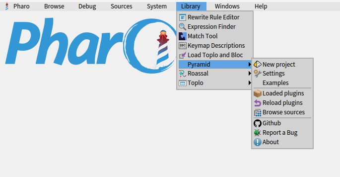

This will directly open the Pyramid tool in a Pharo window.

# Getting started with Pyramid

## Keyboard shortcuts

### Intern at Pyramid

| **Shortcuts** | **Key combination** | **Description** |
|:--:|:--:|----|
| Undo | CTRL + Z | Go back to the previous action if there is any. |
| Redo | CTRL + Y | Go back to the action where we previously went back. |
| Copy | 1 selected element + CTRL + C | Allows copying the item that is currently selected. |
| Paste | CTRL + V | Allows you to paste an item that was previously copied on the workspace. |
| Paste into an element | 1 selected element + CTRL + V | Allows you to paste into a selected element and add it as wires. |
| Cut | 1 selected element + CTRL + X | Allows you to cut the selected item. |
| Save | CTRL + S | Allows saving an open and configured project. |
| Select all | CTRL + A | Allows you to select all the elements of the workspace. |
| Select all wires | 1 selected element + CTRL + A | Allows you to select all the wires of the selected element. |
| Grid | CTRL + G | Allows to enable / disable the grid on the workspace |
| Delete the selection | 1 or more selected element + DEL | Allows to delete the selected item(s). |
| Inspect the element | 1 selected element + CTRL + I | Allows to inspect the selected item. |
| Move a child up | 1 selected element + Page up | Allows to move up a child in its parent tree. |
| Move a child down | 1 selected element + Page Down | Allows to move down a child in its parent tree. |
| Move the view | CTLR + Clicked moved | Allows the view to be moved across the workspace. |
| Default position of view | CTRL + N | Allows to reset the position of the view on the workspace by default (location) |
| Zoom in on the workspace | CTRL + Mollette Up | Allows you to zoom in on the workspace. |
| Zoom out on the workspace | CTRL + Mollette Low | Allows zooming out of the workspace. |

All the shortcuts below only work with the focus on space (workspace) in
Pyramid.

| **Shortcuts** | **Key combination** | **Description** |
|:--:|:--:|----|
| Move an element down | 1 selected element + Down arrow | Moves a selected item downwards. |
| Move an element to the right | 1 selected element + Right Arrow | Moves a selected item to the right. |
| Move an element to the left | 1 selected element + Left Arrow | Move a selected item to the left. |
| Move an element up | 1 selected element + Up Arrow | Move a selected item upwards. |
| Move an element to the mouse position | 1 selected element + CTRL + Space bar | Moves a selected item to the mouse position. |

### External to Pyramid

| **Shortcuts** | **Key combination** | **Description** |
|:--:|:--:|----|
| Open a space in Pyramid | F12 + focus on a space of a Bloc/Toplo window | Allows opening directly in Pyramid an application that runs in another window running in Pharo Bloc/Toplo. |

## Description of the interfaces

First, you can see below the overall overview of the interface when you
open the Pyramid tool.

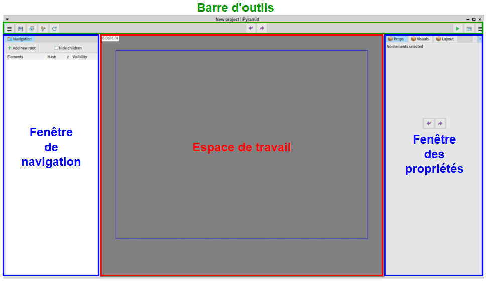

### Parameterization toolbar

#### Button hide the navigation window 

Allows you to hide the navigation window:

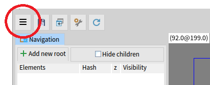

It’s a toggle button, so you can hide the window by clicking on it, but
also make it visible when you click on it a second time.

#### Save button

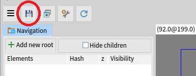

This button is used to save the changes made and generate the
corresponding source code.

If the project configuration has not been done, an error is displayed:

To remedy this, you must first define the project configuration (see
next button).

#### Project configuration button

To configure the project backup:

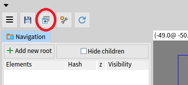

The button opens a window that allows configuring the project save
location:

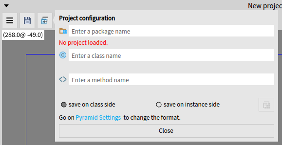

To configure the project backup in the tab of the "project
configuration" button, you must fill out the following three fields:

- The package name

- The class name

- The method name

Choose whether to save on class side or instance side.

#### User parameter button

Allows to open the Pyramid user settings interface with the following
two parameters:

- Enable/Disable the F12 shortcut which allows opening a Block/Toplo
  window in Pyramid

- Choose the serialization format either in source code or in STON

Parameter window below:

#### Refresh button

Allows to refresh the workspace (central area):

This button allows to solve problems such as the preview of the project
in the central area that no longer appears, so it allows to refresh and
solve this issue.

Example:

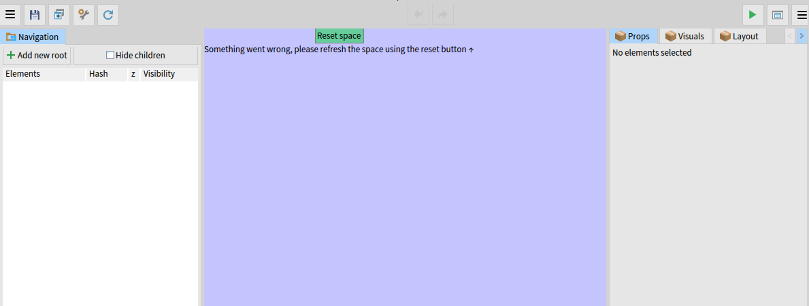

### Undo/Redo buttons

### 

These buttons are located in the center of the toolbar, above the work
area.

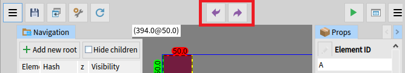

The button with an arrow to the left (Undo) is used to go back on a past
action and the arrow going to the right (Redo) allows to replay the
previously canceled action.

### Workspace Toolbar

#### Test button

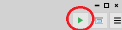

It allows the workspace to be run and therefore, to use the buttons such
as for example displaying a message in Pharo with a notification when
clicking on it.

When in test mode, the button icon is modified and we can exit the test
mode by clicking on it again:

#### Workspace properties button

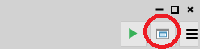

It allows to change the size of the workspace displayed in the preview
part of the HMI by opening the following window:

But also to be able to display or hide a grid thanks to its visibility
parameter:

One can also modify the spacing between two lines thanks to the value of
the 'Spacing' field which is modifiable.

The color is also configurable either by hexadecimal value and its alpha
(transparency).

Or thanks to a user interface available through the following button:

The interface of color choice:

The first line also corresponds to the choice of color via a hexadecimal
value and an alpha (transparency).

The choice of colors is made via the interfaces.

When you enter a value in a text field, please press the "Enter" key to
validate the changes ("Enter" on the keyboard, not the "Enter" located
on the numeric keypad).

#### Button hide the properties window

This button allows, as for the hide the navigation window button, to be
able to hide the property window on the right.

### Navigation window

This window contains the tree structure of the graphic elements edited
in the current project, as well as buttons/ features to manipulate them.

#### Add a new root button

This button allows you to add a root element that you choose via the
window that opens. See below.

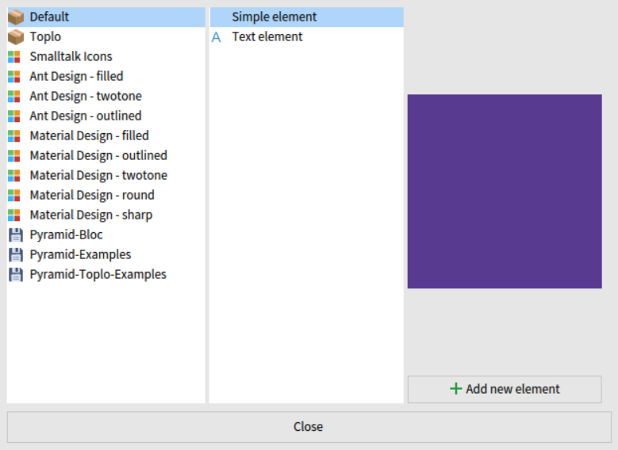

##### Column of categories

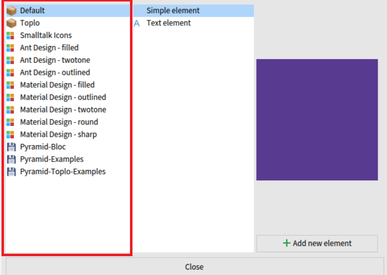

This column is used to display the different available categories and
display them in the content visualization column of the selected
category.

##### Column for viewing the category content

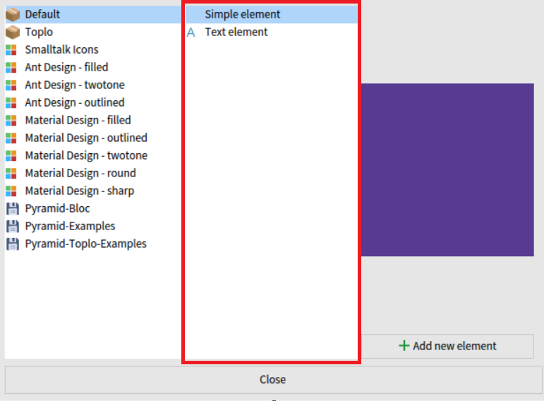

This column is used to view the different elements available in the
category selected in the categories column.

##### Preview column

This column is used to view the selected element in the right-hand
column and allows it to be added to the workspace with 'add new
element'.

Example of adding the element:

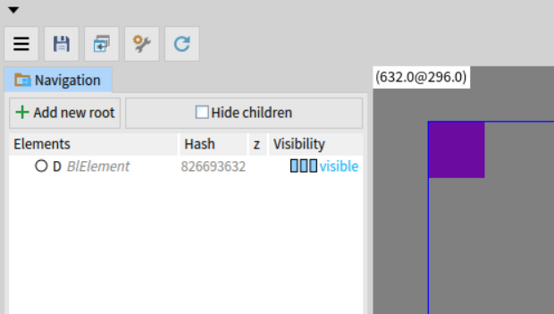

#### Checkable button hide/show threads

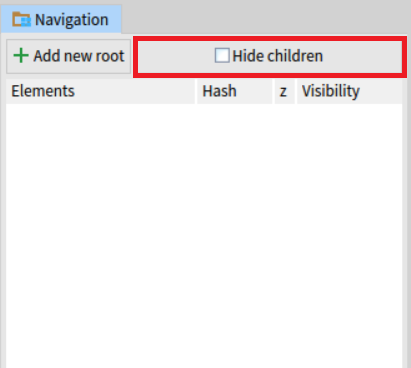

This checkbox allows you to hide (or display) the threads of elements
with which one cannot interact in Pyramid (non-serialized element).

Example of a tree with all the children visible:

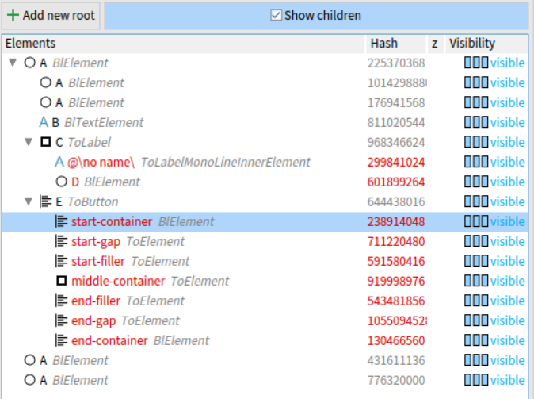

When children are not visible:

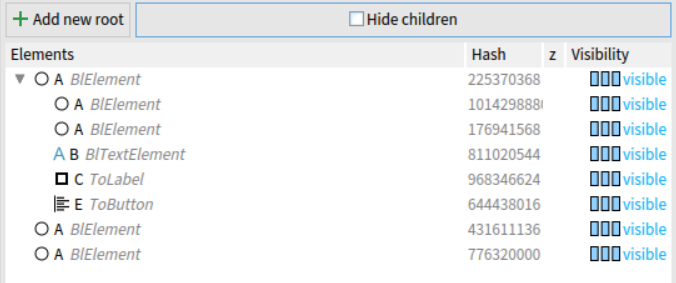

#### List of threads in the workspace

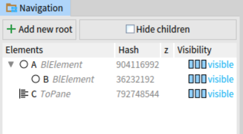

This list allows to see all the common elements used in the workspace,
and allows to observe the current project tree structure.

One can also interact on each element with a context menu thanks to the
right click.

### Context menu right click

This context menu works only in the following areas:

- Navigation window

- Workspace (central area)

We can see the context menu that displays the name, the element (class)
and its Hash on the first line.

#### Search for the selected item

Opens the next window to display the class of the element. See below.

#### Inspection of the selected element

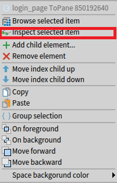

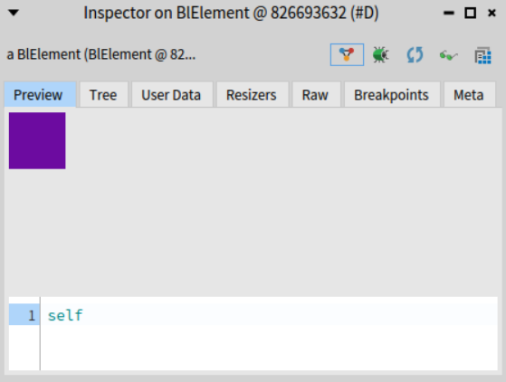

Allows an inspection of the element as if it were being done from a
playground.

#### Adding a child and removing an element

Adding a child allows you to add an element as a child to the selected
element and thus to be able to add it to its tree structure.

Deleting the selected element removes the element and all its children.

Example of deleting several elements:

#### Modify the index of a child in its parent

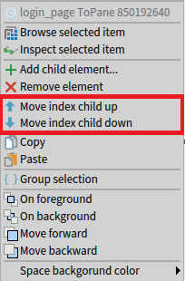

These 2 options allow you to very easily modify the index of the
children selected in their parents, either by increasing or decreasing
it.

Example before travel:

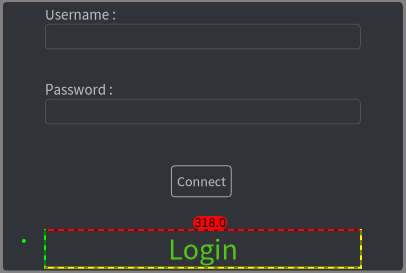

Example after move:

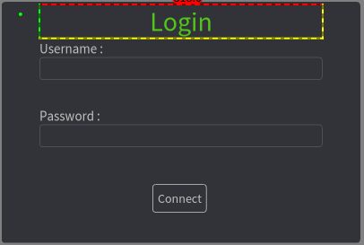

There are also keyboard shortcuts to do it (Page Up and Page Down).

#### Group the selection of elements

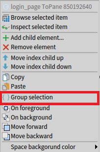

Allows one or more selected elements to be grouped into a single group
during multi-selection.

#### Level on the layer

Allows you to change the level on the layer of the selected element:

- On foreground: place the element in the foreground

- On background : place the element last

- Move forward: increases by one layer level

- Move backward: reduced by a layer level

#### Copy/Paste

Allows you to copy a selected item and paste it into the workspace or
another item that is selected.

### Properties window

Here is the properties window when not selecting an element, this window
consists of 6 tabs as follows:

- Props

- Visual

- Layout

- Geo

- Toplo-Theme

- Playground

#### Properties tab (Props)

The properties available for each selected element may be different
depending on the nature of the element.

Here are the possible options in Props when selecting an element:

Element ID:

It is the ID name of the selected element. To modify it, you must write
something in place of the text already present in this text field and
**do not forget to validate with input** in order to make the
modification effective; otherwise, the modification will not be saved.

Visibility:

Allows to make:

- Visible: visible on the workspace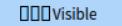

- hidden: hidden on the workspace

- gone : hidden on workspace and is not calculated by
  layout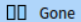

Elevation:

Value of the element on the layer specified in modifiable or viewable
integer value.

Clip children:

Allows to make invisible the children of an element that are out of the
parent size (exceeds the parent size) if the value is True, otherwise
the opposite.

#### Visual tab (Visuals)

It is a tab that allows you to define the different graphic properties
of the selected element: opacity, color, borders, etc.

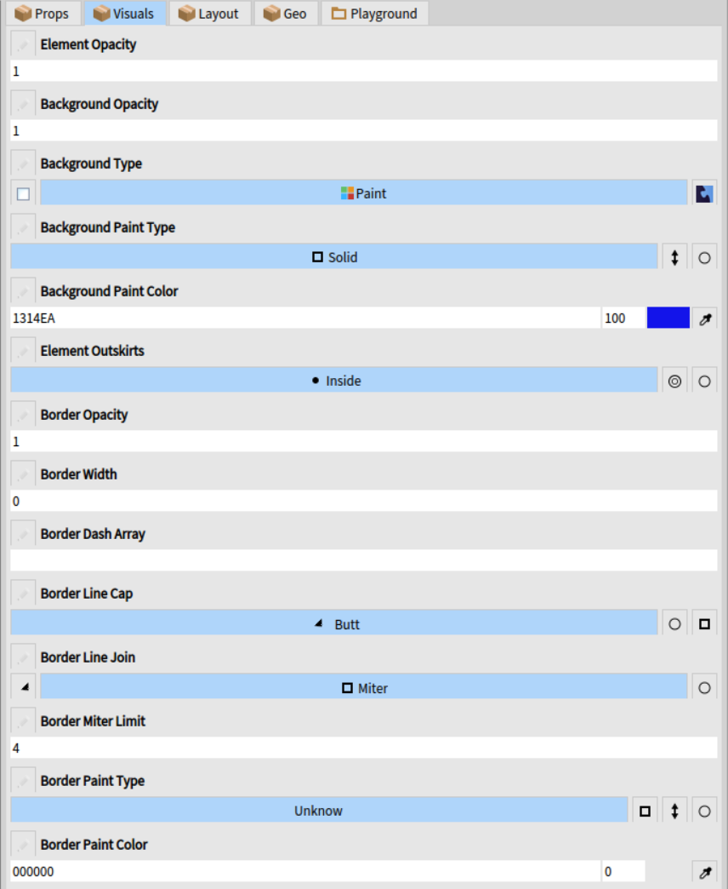

#### Layout tab

This tab allows you to define the position of the element in its
environment, but also to define a layout within this element directly.

Position:

X and Y location of the selected editable item in both input fields.

Filling:

Define a fill in the selected item according to the value in the input
field.

Margin:

Define a margin in the selected item according to the value in the input
field.

Type of provision:

##### Basic layout

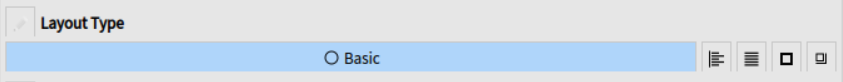

The basic layout allows to place as one wants without particular
constraint of element in the selected element.

##### Linear layout

Vertical:

The green element is the first element and the red element is the
second, according to the direction of the arrow above on the example.

Horizontal:

The green element is the first element and the red element is the
second, according to the direction of the arrow above on the example.

The linear layout allows aligning elements even beyond the size of the
parent.

##### Flow arrangement

Vertical:

Horizontal:

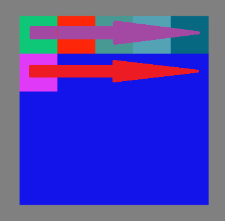

The purple arrow represents the first line of the layout and the red
arrow the second line. When a line is filled, the elements are
automatically added to the next line. Here, the element in pink is
automatically added to the second line.

##### Frame layout

The different position settings are not made in the parent but in the
children of the element in which there is this layout.

The constraints – Frame – horizontal / vertical are used only for
positioning this element in its parent thanks to the layout defined in
the parent.

This option allows the element not to be aligned with the frame layout.

#### Geometry tab (Geo)

This tab allows you to choose the geometric shape of the selected
element, the selected geometry will be the one visible on the selected
logo.

Some elements may not have geometry

#### Theme management tab (Toplo-Theme)

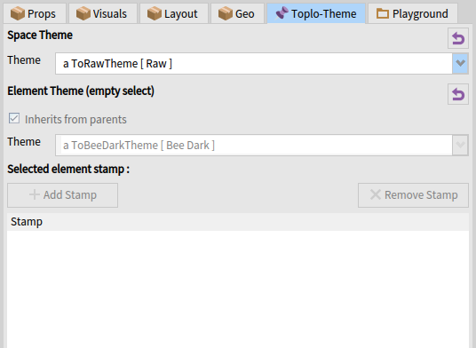

This tab allows you to define and visualize themes by applying them
either on the workspace (BlSpace) or on the different elements in the
workspace (local theme).

When selecting an element on the workspace, several actions are
possible:

- Do not inherit the theme from the parent and choose the theme to apply
  on himself and these children

- Add a label (stamp) on the selected element (greyed out if no element
  has been selected).

- Delete a selected label from the listed label table (grayed out if no
  label is selected).

Example (no applied theme):

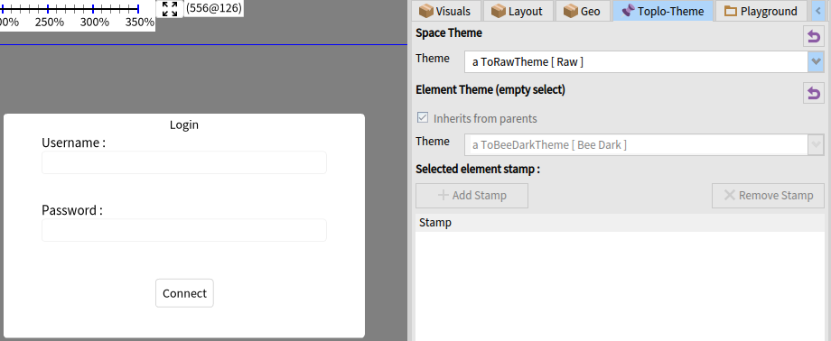

Example (after the applied theme):

The labels to add for a selected element are listed according to the
theme chosen for this element.

Example:

To add a label, select the label you want to assign and click on 'Add a
label'.

List of labels already used on the selected item:

Remove a label:

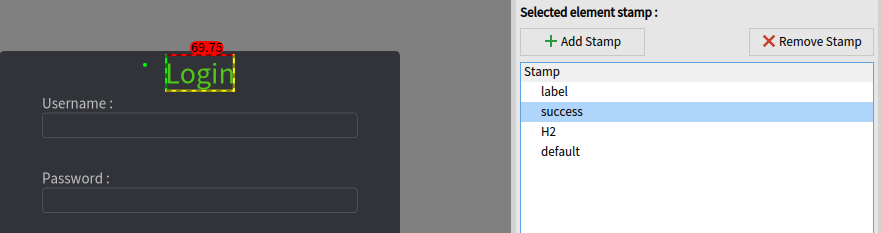

Once a label is selected in the list, the "Remove stamp" button becomes
clickable and allows to delete the selected label.

##### Adding a theme for toplo theme manager

To add a theme to the list of themes available in the selector for the
toplo theme manager, you must add a class method in the class of the
theme that inherits ToTheme.

Example:

canBeDefault true

If you want to remove a specific theme from the selector, you must
change 'true' to 'false':

canBeDefault false

#### Playground tab

The Playground is a tab that allows actions to be performed on one or
several selected elements thanks to Smalltalk code (Pharo).

Only the keyboard shortcuts native to Pharo allow you to be able to
execute commands in the playground.

Here is the tab when no element is selected, see above.

The actions of the Playground and execute on the selected element(s).

Example with a BlElement:

Before modification:

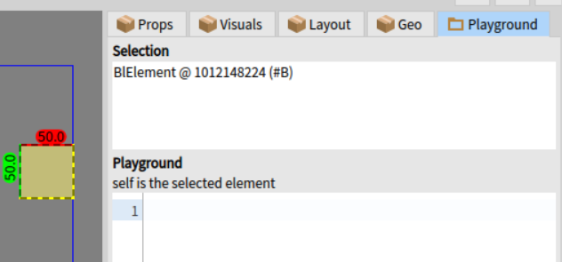

After modification:

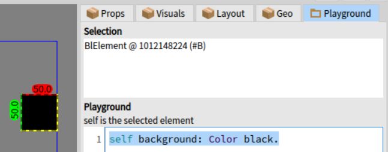

Thanks to the following message, the color of the background has become
black:

self background : Color black.

This is only an example but all the messages in the Playground are
possible as natively in Pharo.

The small peculiarity is that several selected elements are considered
as an object array, so this time the previous command will not work
because it is necessary to execute the command on all the elements
present in the array.

Before:

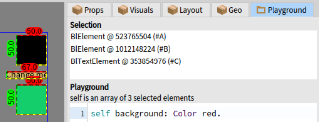

The command allows to iterate on each element and to apply the red color
on the background of each element:

self do: \[ :c \| c background: Color red \].

After:

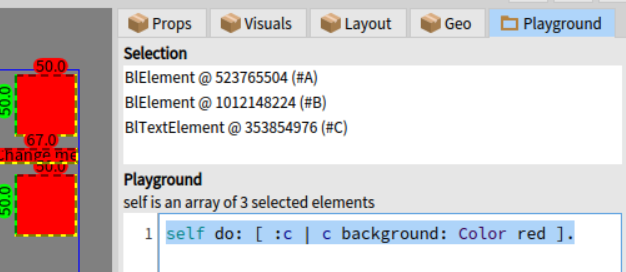

### Workspace

The workspace is the display area for project graphic elements.

Window preview:

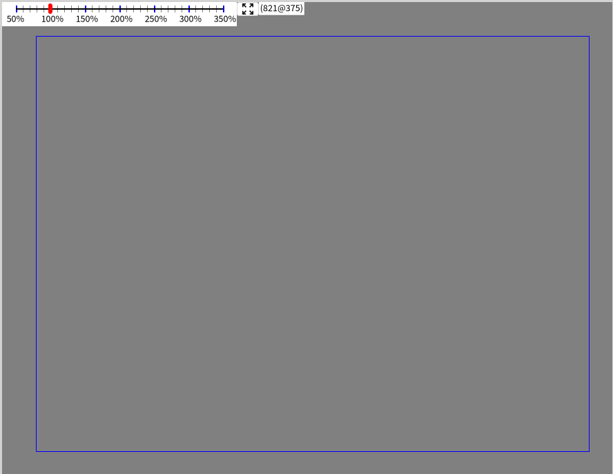

The slider allows you to modify the zoom factor on the workspace, the
button to its right allows you to return to the initial zoom value
(100%) of the view on the workspace and the position of the mouse is
indicated next to it.

## 

## Features

### Clicked arborescence modification dragged / dropped

Example:

We can see an element whose name is "connect_pane" that is not in the
right place, so we can move it via a click dragged from the list of
elements on the left.

Placed in the right place as below:

Result:

The system works as follows:

All selected elements that are moved via a click-drag will be the child
of the target element if they can.

### Dynamic resizing of selected element

: Changes the size of the selected element in width but only in
horizontal direction.

: Changes the size of the selected element in width but also in height
freely, there is also the possibility to be able to keep the proportions
of the element by pressing the control key during the size modification.

: Change the size of the selected element in height but only in vertical
direction.

Limitation of dynamic size modification:

- When the element width is below 50, the square to change size for
  height disappears.

- When the height of the element is below 50, the square to change the
  size for width disappears.

- When height and width is below 15, the square to change height and
  width disappears.

So at the moment of releasing the left click of the mouse, the size is
indeed taken into account but once you want to reuse them, you need to
manually enlarge the element, deselect it and select it once more.
